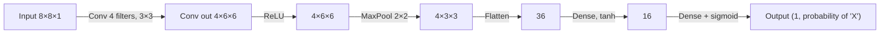

# CNN — From Scratch

A NumPy-only Convolutional Neural Network — convolution, ReLU, max-pooling, and
a dense classification head — trained with manually derived backpropagation.
This is also the first **classification** task in the series (the earlier
modules were all regression), and the first architecture built for spatial data
instead of sequential data.

## Builds On

[`MLP — From Scratch`](../mlp/README.md) for the dense output head (flatten →
dense → dense, same forward/backward pattern as the MLP). What's new is the
**convolutional front end**, which shares weights across *space* the same way
the RNN/LSTM modules shared weights across *time* — a small filter slides over
the whole image instead of every pixel getting its own independent weight.

## Task

Binary image classification: distinguish hand-drawn "X" vs "O" shapes on an
8×8 grid.

- **Data**: synthetically generated (no external dataset needed) — X and O
  shapes drawn procedurally, with small random translations and random pixel
  noise per sample so the network sees genuine variation.
- **Input**: 8×8×1 grayscale image
- **Target**: 1 = "X", 0 = "O"

## Architecture



## Math Intuition

**Convolution**: instead of a dense layer's `W @ x` (one weight per input pixel),
a small `K×K` filter slides across the image, reusing the *same* weights at
every position:

```
z[f, i, j] = Σ (W[f] ⊙ x[:, i:i+K, j:j+K]) + b[f]     # per filter f, position (i,j)
a = ReLU(z)
```

**Max-pooling** downsamples by keeping only the strongest activation in each
window — this makes the network a bit tolerant to small shifts in where a
feature appears:

```
pooled[f, i, j] = max(a[f, window])
```

**Dense head** (identical pattern to the MLP module):

```
flat = pooled.reshape(-1, 1)
h1 = tanh(Wd1 flat + bd1)
y_hat = sigmoid(Wd2 h1 + bd2)     # probability of class "X"
```

**Loss**: binary cross-entropy — `L = -[target·log(y_hat) + (1-target)·log(1-y_hat)]`

**Backward pass** — the dense part is identical to the MLP's backprop. The two
new pieces are:

```
dz2 = y_hat - target        # sigmoid + BCE gradient collapses to this directly
                             # (same clean form as softmax + cross-entropy)

# ... dense backprop as usual down to dpooled ...

# Max-pool backward: route each gradient ONLY to the position that
# was the max during the forward pass — every other position gets zero.
da_conv[f, max_row, max_col] += dpooled[f, i, j]

# ReLU backward: zero out gradient wherever the forward pre-activation was ≤ 0
dz_conv = da_conv * (z_conv > 0)

# Conv weight gradient: for each filter, sum the gradient-weighted
# input patch over every position that filter was applied to
dWc[f] += Σ_{i,j} dz_conv[f, i, j] * x[:, i:i+K, j:j+K]
dbc[f] = Σ_{i,j} dz_conv[f, i, j]
```

The max-pool backward step is the one genuinely new idea here: gradient only
flows through the *one* position that "won" the max in each window — everywhere
else in that window gets zero gradient, since a tiny change there wouldn't have
changed the forward output at all.

## Implementation Notes

- `conv_forward` and `maxpool_forward` are written as explicit nested loops over
  filters and output positions rather than vectorized — slower, but it makes the
  "one filter, one small patch, one dot product" mechanic completely visible,
  matching the rest of the repo's scratch-first philosophy.
- Same per-sample (online) gradient descent as every other module.
- Uses accuracy and a confusion matrix for evaluation, instead of MSE/MAE —
  the right metrics for a classification task.
- Weight init and forward math otherwise follow the same conventions as the
  other modules (small-scale `randn * 0.1` init, explicit bias vectors).

## How to Run

**Dependencies**: `numpy`, `matplotlib`, `scikit-learn`

```bash
pip install numpy matplotlib scikit-learn
```

No external dataset required — the notebook generates its own X/O images. Run
top to bottom; it prints training loss every 20 epochs, final test accuracy and
confusion matrix, then plots the training loss curve and a grid of sample test
predictions.

## What's Next

→ **Transformer**: replaces both flavors of weight-sharing seen so far (over
time in RNN/LSTM, over space in CNN) with **attention** — instead of a fixed
window or a fixed recurrence, every position can directly attend to every other
position, weighted by learned relevance.
