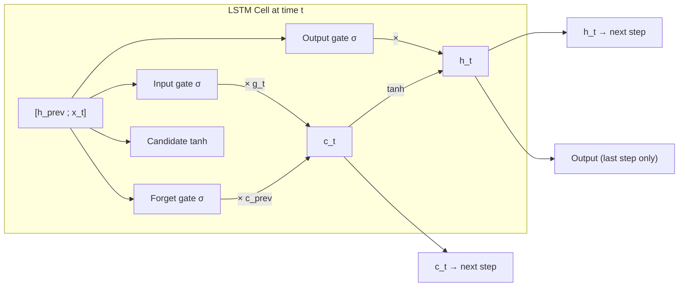

# LSTM — From Scratch

A NumPy-only Long Short-Term Memory network, trained with manually derived
backpropagation through time (BPTT) — including gradients through all four
gates. This builds on the vanilla RNN: same recurrence-over-time idea, but the
plain hidden-state update is replaced with a **gated cell state**, which is what
lets the network carry information across longer sequences without it vanishing.

## Builds On

[`Vanilla RNN — From Scratch`](../rnn/README.md). The RNN updates its hidden
state directly with a single `tanh`, which makes gradients shrink fast as they
travel backward through many time steps. The LSTM fixes this by adding a
**cell state** (`c_t`) that flows through time almost untouched, regulated by
three gates that decide what to forget, what to add, and what to output.

## Task

Same regression target as MLP/RNN, but with a genuinely useful sequence this
time: predict `next_day_temp` from a **5-day sliding window** of the previous
days' readings, instead of treating one day's 3 readings as the sequence.

- **Input**: a window of `T = 5` consecutive days, each with `temp_morning`,
  `temp_afternoon`, `temp_evening`
- **Target**: `next_day_temp` of the day right after the window
- **Dataset**: `temp_vanilla.csv` (place in this folder before running)

## Architecture



## Math Intuition

**Forward pass**, at each time step `t` (with `z_t = [h_{t-1} ; x_t]`):

```
f_t = σ(Wf z_t + bf)              # forget gate  — what to drop from c_{t-1}
i_t = σ(Wi z_t + bi)              # input gate   — what to add
g_t = tanh(Wg z_t + bg)           # candidate    — the new info to (maybe) add
o_t = σ(Wo z_t + bo)              # output gate  — what part of c_t to expose

c_t = f_t ⊙ c_{t-1} + i_t ⊙ g_t   # cell state: gated carry + gated new info
h_t = o_t ⊙ tanh(c_t)             # hidden state: gated readout of the cell
```

Only the final hidden state `h_T` feeds the output layer (many-to-one, same as
the RNN): `y_hat = Why h_T + by`.

**Backward pass** — the gradient into the cell state at each step comes from two
places: the *next* time step's cell state (through the forget gate) and this
step's own hidden state:

```
dh = dh_next                                    # total dL/dh_t, seeded from output layer
do      = dh ⊙ tanh(c_t)
do_raw  = do ⊙ o_t ⊙ (1 - o_t)                   # σ'(z) = o_t(1 - o_t)

dc = dc_next + dh ⊙ o_t ⊙ (1 - tanh(c_t)²)       # two sources of gradient into c_t

df      = dc ⊙ c_{t-1}      df_raw = df ⊙ f_t ⊙ (1 - f_t)
di      = dc ⊙ g_t          di_raw = di ⊙ i_t ⊙ (1 - i_t)
dg      = dc ⊙ i_t          dg_raw = dg ⊙ (1 - g_t²)

dz = Wfᵀdf_raw + Wᵢᵀdi_raw + Wgᵀdg_raw + Woᵀdo_raw
dh_next = dz[:hidden_size]      # gradient into h_{t-1}
dc_next = dc ⊙ f_t              # gradient into c_{t-1}, gated by how much
                                 # this step chose to "forget"
```

The `dc_next = dc ⊙ f_t` line is the whole point of the architecture: because
the cell state's backward path multiplies by `f_t` (close to 1 when the network
learns to "keep remembering") instead of by a `tanh` derivative at every step,
gradients can survive much longer sequences than in a vanilla RNN.

## Implementation Notes

- `z_t = [h_{t-1} ; x_t]` — all four gates share the same concatenated input,
  each with its own weight matrix (`Wf`, `Wi`, `Wg`, `Wo`).
- Every gate's pre-activation gradient (`df_raw`, `di_raw`, `dg_raw`, `do_raw`) is
  computed the same way: local gradient × derivative of that gate's activation
  (`σ'` for the three sigmoid gates, `tanh'` for the candidate).
- Forward-pass caches (`fs`, `iis`, `gs`, `os_`, `hs`, `cs`, `zs`) store every
  gate's activation and both states at every time step — BPTT needs all of them.
- This module builds actual multi-day sequences (`T = 5`, sliding window) rather
  than the RNN's single-day 3-reading sequence, giving the gating mechanism a
  real long-range dependency to exploit.

## How to Run

**Dependencies**: `numpy`, `pandas`, `scikit-learn`, `matplotlib`

```bash
pip install numpy pandas scikit-learn matplotlib
```

Place `temp_vanilla.csv` in this folder, then run the notebook / script top to
bottom. It prints training loss every 100 epochs, final MSE/MAE on the test set,
and shows an actual-vs-predicted plot.

## What's Next

→ **CNN**: steps away from sequences and back toward the MLP's "all inputs at
once" style, but replaces fully-connected layers with convolutional filters —
weight sharing over *space* instead of *time*.
