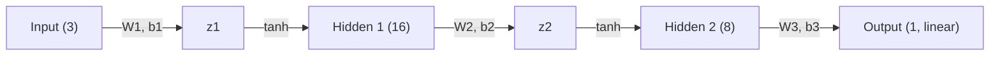

# Multilayer Perceptron (MLP) — From Scratch

A NumPy-only implementation of a feedforward neural network, trained with manually
derived backpropagation (no autograd, no framework). This is the first architecture
in the series — it establishes the forward pass / backward pass / gradient descent
loop that every later architecture (CNN, RNN, LSTM, Transformer) builds on.

## Task

Regression: predict the next day's temperature from three readings taken the
previous day (morning, afternoon, evening).

- **Input**: `temp_morning`, `temp_afternoon`, `temp_evening`
- **Target**: `next_day_temp`
- **Dataset**: `temp_vanilla.csv` (place in this folder before running)

## Architecture



| Layer | In → Out | Activation |
|---|---|---|
| 1 | 3 → 16 | tanh |
| 2 | 16 → 8 | tanh |
| 3 (output) | 8 → 1 | linear (regression) |

## Math Intuition

**Forward pass**, for a single sample `x`:

```
z1 = W1 x + b1        a1 = tanh(z1)
z2 = W2 a1 + b2       a2 = tanh(z2)
y_hat = W3 a2 + b3    (linear output — no activation, since this is regression)
```

**Loss** (per sample): `L = 0.5 * (y_hat - target)²`

**Backward pass** (chain rule, applied layer by layer, output → input):

```
dL/dy_hat = (y_hat - target)

dW3 = dy_hat · a2ᵀ            db3 = dy_hat
da2 = W3ᵀ · dy_hat
dz2 = da2 ⊙ (1 - a2²)          # tanh'(z) = 1 - tanh(z)²

dW2 = dz2 · a1ᵀ                db2 = dz2
da1 = W2ᵀ · dz2
dz1 = da1 ⊙ (1 - a1²)

dW1 = dz1 · xᵀ                 db1 = dz1
```

Each weight is then updated with plain gradient descent:
`W ← W - learning_rate * dW`.

The key idea the whole repo is built around: **every gradient is just the chain
rule applied one layer at a time**, propagating the error signal `dy_hat` backward
through each `tanh` and each linear layer. Later architectures (CNN, RNN, LSTM)
reuse this exact same mechanism — they just change what the "layer" is.

## Implementation Notes

- Training uses **per-sample (online) SGD** — the weights update after every
  single example, not after a batch. This trades speed for transparency: it
  makes it easy to trace one example through the whole forward/backward pass by
  hand, which is the point of a "from scratch" repo.
- Inputs and target are standardized (`StandardScaler`) before training; predictions
  are inverse-transformed back to the original temperature scale for evaluation.
- Evaluated with MSE and MAE, and a plot of actual vs. predicted test values.
- `np.random.seed(42)` is present but commented out — uncomment it if you want
  reproducible results across runs.

## How to Run

**Dependencies**: `numpy`, `pandas`, `scikit-learn`, `matplotlib`

```bash
pip install numpy pandas scikit-learn matplotlib
```

Place `temp_vanilla.csv` in this folder, then run the notebook / script top to
bottom. It will print training loss every 100 epochs, final MSE/MAE on the test
set, and show an actual-vs-predicted plot.

## What's Next

→ **CNN**: swaps the fully-connected layers for convolutional filters, introducing
weight sharing and spatial structure — the next building block in the series.
