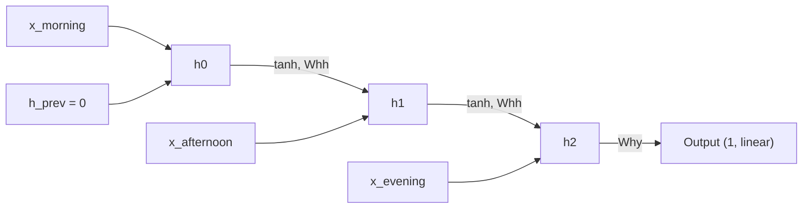

# Vanilla RNN — From Scratch

A NumPy-only recurrent neural network, trained with manually derived
**backpropagation through time (BPTT)**. This builds directly on the MLP module:
same forward/backward/gradient-descent loop, but now the network processes the
input **one time step at a time** and carries a hidden state forward — the key
idea that separates sequence models from plain feedforward networks.

## Builds On

[`MLP — From Scratch`](../mlp/README.md). The MLP fed all 3 temperature readings
into the network at once, as a single flat vector. This RNN instead treats them
as a **sequence of 3 time steps**, feeding one reading at a time and reusing the
same weights at every step — the network "remembers" earlier steps through its
hidden state.

## Task

Same regression task as the MLP module — predict the next day's temperature —
but now the 3 readings are fed sequentially instead of all at once.

- **Input**: `temp_morning`, `temp_afternoon`, `temp_evening`, fed one per time step (`T = 3`)
- **Target**: `next_day_temp`
- **Dataset**: `temp_vanilla.csv` (place in this folder before running)

## Architecture



The same weights (`Wxh`, `Whh`, `bh`) are reused at every time step — this weight
sharing across time is what makes it a *recurrent* network rather than 3 separate
MLPs.

## Math Intuition

**Forward pass**, unrolled over `t = 0, 1, 2` (with `h_{-1} = 0`):

```
h_t = tanh(Wxh x_t + Whh h_{t-1} + bh)

y_hat = Why h_2 + by     # only the FINAL hidden state feeds the output
                         # ("many-to-one" RNN)
```

**Loss**: `L = 0.5 * (y_hat - target)²`

**Backward pass (BPTT)** — the same chain rule as the MLP, but now applied
*backward through time* as well as through layers. The gradient flowing into each
hidden state comes from two places: the output layer (only at the last step) and
the *next* time step's hidden state (for every earlier step):

```
dy = y_hat - target
dWhy = dy · h_2ᵀ            dby = dy
dh_next = Whyᵀ · dy          # gradient seeded into the last hidden state

for t = 2, 1, 0:             # walk backward through time
    da = dh_next ⊙ (1 - h_tᵀ²)     # tanh'(z_t)
    dbh  += da
    dWxh += da · x_tᵀ
    dWhh += da · h_{t-1}ᵀ          # (zero at t=0, since h_{-1} = 0)
    dh_next = Whhᵀ · da            # pass gradient to the previous time step
```

This loop is exactly what "backpropagation through time" means: the same `da →
dWxh, dWhh, dbh → dh_next` step repeats for each time step, walking backward from
the last step to the first, accumulating gradients for the *shared* weights along
the way.

## Implementation Notes

- **Weight sharing**: `Wxh`, `Whh`, `bh`, `Why`, `by` are each a *single* set of
  weights used at every time step — contrast with the MLP, where every layer had
  its own independent weights.
- Hidden states from the forward pass (`hs`) are cached in a list so BPTT can
  reuse them — this is standard practice: BPTT needs every intermediate hidden
  state, not just the final one.
- Only the last hidden state (`h_2`) is passed to the output layer — a
  "many-to-one" setup, appropriate since this task predicts a single value from
  the whole sequence.
- Per-sample (online) SGD, same as the MLP module, for the same reason:
  traceability over training speed.

## How to Run

**Dependencies**: `numpy`, `pandas`, `scikit-learn`, `matplotlib`

```bash
pip install numpy pandas scikit-learn matplotlib
```

Place `temp_vanilla.csv` in this folder, then run the notebook / script top to
bottom. It prints training loss every 100 epochs, final MSE on the test set, and
shows an actual-vs-predicted plot.

## What's Next

→ **LSTM**: a plain RNN's gradient has to travel through every time step
unchanged during BPTT, which makes it prone to vanishing (or exploding) over
longer sequences. LSTM introduces gates that control what information flows
forward and backward, fixing exactly that weakness — the next building block in
the series.
